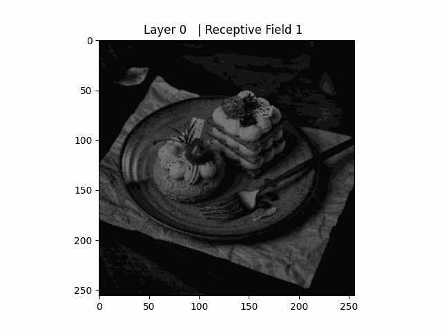

# pytorch-receptive-field

Compute CNN receptive field size in pytorch. Support both 2D CNN and 3D CNN.


## Create 2D visualization gif
```python
# pip install git+https://github.com/Fangyh09/pytorch-receptive-field.git
from torch_receptive_field import receptive_field
from torch_receptive_field import receptive_field_visualization_2d

receptive_field_dict = receptive_field(model, (3, 256, 256))
image_path = "./examples/example.jpg"
output_path_without_extension = "./examples/example_receptive_field_2d"
receptive_field_visualization_2d(receptive_field_dict, image_path, output_path_without_extension)
```


## Usage
`pip install git+https://github.com/Fangyh09/pytorch-receptive-field.git`

```python
from torch_receptive_field import receptive_field
receptive_field(model, input_size=(channels, H, W))
```

Or
```python
from torch_receptive_field import receptive_field
dict = receptive_field(model, input_size=(channels, H, W))
receptive_field_for_unit(receptive_field_dict, "2", (2,2))
```

## Example 2D CNN
```python
import torch
import torch.nn as nn
import torch.nn.functional as F
from torch_receptive_field import receptive_field

class Net(nn.Module):
    def __init__(self):
        super(Net, self).__init__()
        self.conv = nn.Conv2d(3, 64, kernel_size=7, stride=2, padding=3, bias=False)
        self.bn = nn.BatchNorm2d(64)
        self.relu = nn.ReLU(inplace=True)
        self.maxpool = nn.MaxPool2d(kernel_size=3, stride=2, padding=1)
        self.avgpool = nn.AvgPool2d(kernel_size=3, stride=2, padding=1)

    def forward(self, x):
        y = self.conv(x)
        y = self.bn(y)
        y = self.relu(y)
        y = self.maxpool(y)
        y = self.avgpool(y)
        return y

device = torch.device("cuda" if torch.cuda.is_available() else "cpu") # PyTorch v0.4.0
model = Net().to(device)

receptive_field_dict = receptive_field(model, (3, 256, 256))
receptive_field_for_unit(receptive_field_dict, "2", (1,1))
```
```
------------------------------------------------------------------------------
        Layer (type)    map size      start       jump receptive_field 
==============================================================================
        0             [256, 256]        0.5        1.0             1.0 
        1             [128, 128]        0.5        2.0             7.0 
        2             [128, 128]        0.5        2.0             7.0 
        3             [128, 128]        0.5        2.0             7.0 
        4               [64, 64]        0.5        4.0            11.0 
        5               [32, 32]        0.5        8.0            19.0 
==============================================================================
Receptive field size for layer 2, unit_position (1, 1),  is 
 [(0, 6.0), (0, 6.0)]
```

### More
`start` is the center of first item in the map grid .

`jump` is the distance of the adjacent item in the map grid.

`receptive_field` is the field size of the item in the map grid.


## Example 3D CNN
```python
import torch
import torch.nn as nn
import torch.nn.functional as F
from torch_receptive_field import receptive_field

class Net3D(nn.Module):
    def __init__(self):
        super(Net3D, self).__init__()
        self.conv = nn.Conv3d(3, 6, kernel_size=3, stride=1, padding=1, bias=False)
        self.bn = nn.BatchNorm3d(6)
        self.relu = nn.ReLU(inplace=True)
        self.maxpool = nn.MaxPool3d(kernel_size=2, stride=2, padding=1)

    def forward(self, x):
        y = self.conv(x)
        y = self.bn(y)
        y = self.relu(y)
        y = self.maxpool(y)
        return y

device = torch.device("cuda" if torch.cuda.is_available() else "cpu") # PyTorch v0.4.0
model = Net().to(device)

receptive_field_dict = receptive_field(model, (3, 16, 16, 16))
receptive_field_for_unit(receptive_field_dict, "2", (1,1,1))
```
```
------------------------------------------------------------------------------
        Layer (type)    map size        start       jump receptive_field 
==============================================================================
        0             [16, 16, 16]        0.5        1.0             1.0 
        1             [16, 16, 16]        0.5        1.0             3.0 
        2             [16, 16, 16]        0.5        1.0             3.0 
        3             [16, 16, 16]        0.5        1.0             3.0 
        4              [9, 9, 9]          0.0        2.0             4.0 
==============================================================================
Receptive field size for layer 2, unit_position (1, 1, 1),  is 
 [(0, 3.0), (0, 3.0), (0, 3.0)]
```

## Related
Thanks @pytorch-summary

https://medium.com/mlreview/a-guide-to-receptive-field-arithmetic-for-convolutional-neural-networks-e0f514068807

